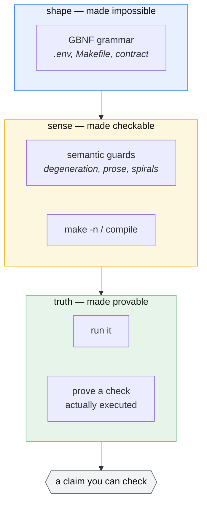
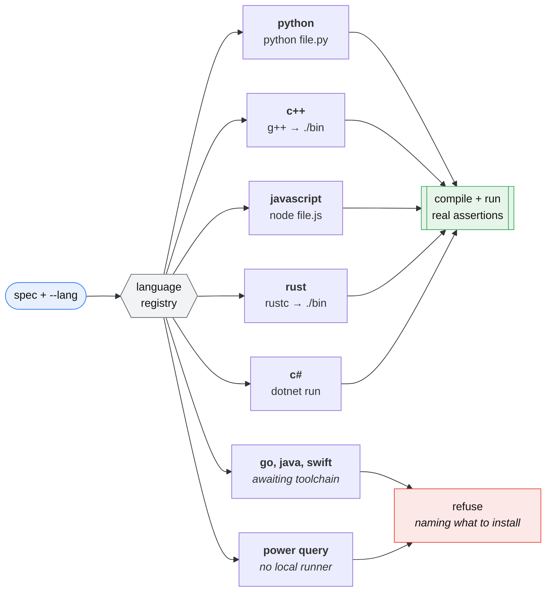

# PureCoder

[](https://github.com/jurewiczM/PureCoder/actions/workflows/tests.yml)
[](pyproject.toml)
[](LICENSE)

A constrained, code-only agentic coder that runs on a **6 GB laptop GPU**.

PureCoder wraps a small open-weights code model (Qwen2.5-Coder-7B) in a harness
that makes its output *reliable* rather than merely plausible: grammars force
valid config files, real tools validate every artifact, generated code is
checked by **actually running it** against independently-written tests, and a
fix loop feeds real errors back until the output works. It scaffolds whole
small projects and grounds generation in a library's own docs via retrieval.

The bet: a small model, boxed in from several directions, can produce
trustworthy code — no frontier API, no cloud, nothing leaving your machine.

## How it works

Every arrow out of the model leads into something that can say **no**:


The test designer never sees the implementation, so it cannot rubber-stamp a
bug. The gate judges the tests before they judge the code. The executor is the
only thing allowed to declare success, and only by running.

## Why it's interesting

Most "LLM writes code" demos trust the model. PureCoder verifies it. Every
layer assumes the model can be wrong and catches it:

- **Grammars** (llama.cpp GBNF) make invalid `.env` / Makefile output
  structurally impossible — not discouraged, impossible.
- **Real-tool validators** run `make -n`, `compile()`, and semantic guards;
  a validator that rubber-stamps garbage is worse than none.
- **Execution validation** runs the code against **code-blind** tests
  (the tester never sees the implementation, so it can't rubber-stamp bugs).
- **A test-quality gate** rejects bad tests before they judge code —
  "who tests the tester."
- **Spec contracts** turn prose into a structured contract the writer and
  tester both read, and compile its examples into assertions **no model
  wrote** — so a misread spec is visible instead of silently agreed on.
- **Retrieval** injects a library's real docs only when relevant, keeping
  token use low on a tight context budget.

### What each layer catches



A grammar guarantees *shape* and nothing more — a 2500-character comment is a
structurally valid comment. Validators add *sense*. Only execution gives
*truth*, and even then exit code 0 is not evidence: the tests are instrumented
so a suite that never ran an assertion fails instead of passing.

## Install

```bash
git clone https://github.com/jurewiczM/PureCoder.git
cd PureCoder
pip install -e .            # core pipeline
pip install -e ".[rag]"     # + retrieval (pulls in torch, ~2 GB)
```

llama.cpp is a **runtime dependency, not vendored here**. Build it separately
with CUDA and serve the model:

```bash
git clone https://github.com/ggml-org/llama.cpp
cd llama.cpp && cmake -B build -DGGML_CUDA=ON && cmake --build build -j

./build/bin/llama-server \
  -hf Qwen/Qwen2.5-Coder-7B-Instruct-GGUF:Q4_K_M \
  -ngl 99 -c 4096 -fa on --port 8080
```

## Quickstart

```bash
purecoder status
purecoder code "a function parse_ports(s) returning a sorted list of unique valid ports (1-65535), raising ValueError on bad input"
purecoder make "Makefile for a python project: install, test, lint, clean"
purecoder project portcheck "a CLI that reads PORTS env var and prints valid ports"
```

`python -m purecoder <cmd>` works identically if you'd rather not install the
console script.

## RAG over a library's docs

```bash
purecoder ingest ./some_library/docs --store lib
purecoder ask "write code using <that library> to do X" --store lib
```

Embedding is the slow part, so the index persists to `<store>.npy` / `.json` —
ingest once, reuse across runs.

## Commands

| command | what it does |
|---|---|
| `code "<spec>"`    | execution-validated Python function |
| `env "<spec>"`     | grammar-valid `.env` |
| `make "<spec>"`    | validated Makefile |
| `project <name> "<spec>" [dir]` | scaffold a whole project (code + Makefile + .env + README) |
| `ingest <dir>`     | build a RAG index over docs/code |
| `ask "<spec>"`     | doc-grounded, execution-validated code |
| `status`           | live system status |

`project` derives a spec contract by default; `code` does not. Add
`--contract` to opt in, `--no-contract` to opt out, or set
`PURECODER_CONTRACT=1` to change the default for both.

## Layout

```
purecoder/
  client.py      grammar-constrained generation (llama-server /completion)
  contract.py    prose → grammar-constrained spec contract
  anchors.py     contract examples → assertions no model wrote
  validate.py    config validators + write→validate→fix loop
  execute.py     code-blind test designer, test-quality gate, execution validation
  scaffold.py    multi-artifact project orchestrator
  rag.py         code/doc-aware chunking + retrieval
  status.py      live system probe
  cli.py         one entry point over all of it
  grammars/      GBNF: env.gbnf, makefile.gbnf, contract.gbnf
examples/        runnable scripts + portcheck/, a real scaffolder output
tests/           182 model-independent tests (no GPU, no server)
docs/            ARCHITECTURE.md, STATUS.md
```

## Development

```bash
pip install -e ".[dev]"
pytest -q
ruff check purecoder tests examples
```

The suite runs without llama-server or a GPU: the validators, executor, test
gate and chunkers are model-independent by design, and the loops are driven by
a scripted fake model. That is also what CI runs, on Python 3.10–3.12.

## Roadmap: beyond Python

> **Designed, not built.** Today PureCoder generates and validates **Python
> only**, and refuses a spec that asks for anything else rather than silently
> handing back Python. The design below is specified in
> [docs/superpowers/specs/2026-08-02-multi-language-design.md](docs/superpowers/specs/2026-08-02-multi-language-design.md).

A language registry makes adding a language *data* rather than code — one
entry declares how to build, run, and assert, and the executor, CLI and
scaffolder need no changes:



The governing rule: **if it cannot be executed, it is not emitted.** A missing
toolchain is refused with the binary named, not papered over with unvalidated
output. Power Query M runs only inside Excel and Power BI, so no local
execution is possible at any effort level — it is refused permanently, and the
README says so rather than pretending otherwise.

## Architecture

See [docs/ARCHITECTURE.md](docs/ARCHITECTURE.md) for the full design and the
lessons that shaped it. In one line: **writer → validator → fix loop**, per
artifact, with the model's confidence never trusted over an external tool's
verdict.

## Requirements

- A GPU with ~6 GB VRAM (built and tested on an RTX 4050 Laptop)
- llama.cpp built with CUDA, serving Qwen2.5-Coder at Q4_K_M
- Python 3.10+, `requests`, `numpy`; `sentence-transformers` for RAG

## Status

Core pipeline complete and tested end-to-end. See [docs/STATUS.md](docs/STATUS.md).

## License

MIT — see [LICENSE](LICENSE).
