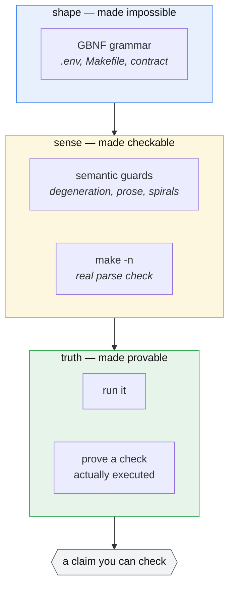
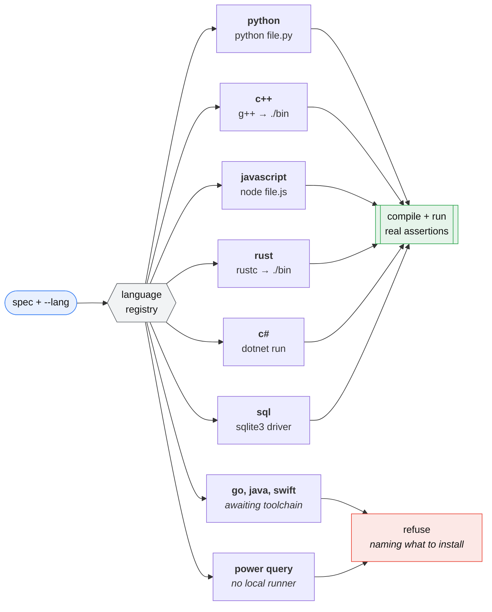

# PureCoder

[](https://github.com/jurewiczM/PureCoder/actions/workflows/tests.yml)
[](pyproject.toml)
[](LICENSE)

A constrained, code-only agentic coder that runs on a **6 GB laptop GPU**.

PureCoder wraps a small open-weights code model (Qwen2.5-Coder-7B) in a harness
that makes its output *reliable* rather than merely plausible: grammars force
valid config files, real tools validate every artifact, generated code is
checked by **actually running it** against independently-written tests, and a
fix loop feeds real errors back until the output works. It scaffolds whole
small projects and grounds generation in a library's own docs via retrieval.

The bet: a small model, boxed in from several directions, can produce
trustworthy code — no frontier API, no cloud, nothing leaving your machine.

## How it works

Every arrow out of the model leads into something that can say **no**:


The test designer never sees the implementation, so it cannot rubber-stamp a
bug. The gate judges the tests before they judge the code. The executor is the
only thing allowed to declare success, and only by running.

## Why it's interesting

Most "LLM writes code" demos trust the model. PureCoder verifies it. Every
layer assumes the model can be wrong and catches it:

- **Grammars** (llama.cpp GBNF) make invalid `.env` / Makefile output
  structurally impossible — not discouraged, impossible.
- **Real-tool validators** run `make -n` and semantic guards on config;
  a validator that rubber-stamps garbage is worse than none.
- **Execution validation** runs the code against **code-blind** tests
  (the tester never sees the implementation, so it can't rubber-stamp bugs).
- **A test-quality gate** rejects bad tests before they judge code —
  "who tests the tester."
- **Spec contracts** turn prose into a structured contract the writer and the
  tester both read, and print it — so a misread spec is visible before any code
  runs, instead of silently agreed on by both.
- **Retrieval** injects a library's real docs only when relevant, keeping
  token use low on a tight context budget.

### What each layer catches



A grammar guarantees *shape* and nothing more — a 2500-character comment is a
structurally valid comment. Validators add *sense*. Only execution gives
*truth*, and even then exit code 0 is not evidence: the tests are instrumented
so a suite that never ran an assertion fails instead of passing.

## Install

```bash
git clone https://github.com/jurewiczM/PureCoder.git
cd PureCoder
pip install -e .            # core pipeline
pip install -e ".[rag]"     # + retrieval (pulls in torch, ~2 GB)
```

llama.cpp is a **runtime dependency, not vendored here**. Build it separately
with CUDA and serve the model:

```bash
git clone https://github.com/ggml-org/llama.cpp
cd llama.cpp && cmake -B build -DGGML_CUDA=ON && cmake --build build -j

./build/bin/llama-server \
  -hf Qwen/Qwen2.5-Coder-7B-Instruct-GGUF:Q4_K_M \
  -ngl 99 -c 4096 -fa on --port 8080
```

## Quickstart

```bash
purecoder status
purecoder code "a function parse_ports(s) returning a sorted list of unique valid ports (1-65535), raising ValueError on bad input"
purecoder make "Makefile for a python project: install, test, lint, clean"
purecoder project portcheck "a CLI that reads PORTS env var and prints valid ports"
```

`python -m purecoder <cmd>` works identically if you'd rather not install the
console script.

## RAG over a library's docs

```bash
purecoder ingest ./some_library/docs --store lib
purecoder ask "write code using <that library> to do X" --store lib
```

`ingest` shows you what it is about to index and waits — every file with its
chunk count, plus what it pruned, skipped as binary, or dropped as a duplicate.
`[e]` drops paths or globs and re-plans; nothing is embedded until you accept,
because chunking is free and embedding is not. It prints the `--exclude` flags
matching your choices so the same index can be rebuilt in one command. `-y`
skips the review, as does a non-interactive stdin.

Embedding is the slow part, so the index persists to `<store>.npy` / `.json` —
ingest once, reuse across runs.

Ranking uses two signals: embedding similarity for *what this is about*, and an
exact-name score for *what you literally typed*. Embeddings are worst at API
symbols, which is most of what gets asked here — `Printf.eprintf` retrieves the
page defining it even when a page merely about output formatting embeds closer.

`ingest` also collects every qualified name the docs use. It cannot tell you a
name is wrong — prose documentation never enumerates a module, and assuming
otherwise flagged 45 pieces of correct code in the measurement that settled it
— but once the compiler has rejected a name, it answers *did you mean* from the
real API instead of leaving the fix loop guessing.

## Teaching it a language it has never run

Six languages exist because someone wrote six registry entries. `learn` points
the pipeline at a language's own documentation and has it draft the seventh:

```bash
purecoder learn zig ./zig-docs --ext .zig
purecoder --lang zig code "a function add(a, b) returning their sum"
```

What the model drafts from those docs: the check helper, the harness tail that
fails a run where no check executed, and the build/run commands (shown to you as
argv, confirmed before anything is executed). What it does **not** draft is the
tester's own instructions — those are templated, because a model writing its own
instructions is the technique that measured worst. The writer's extra demand is
templated too, but from the drafted harness rather than from prose: it is told
that the file already defines the check helper, and either supplies the entry
point or runs statements at top level, so it should write neither and wrap
nothing. Without it a writer that emits its own `main` produces a link error
about a file it never saw; with it, and when it happens anyway, the retry names
what collided.

Then the gate. Five mechanical probes must pass before anything is registered:
correct code passes, **wrong code fails**, an empty suite fails, a suite that
never runs a check fails. A harness that cannot fail wrong code is a rubber
stamp, not a language entry, and is refused with the compiler's own message.
Plus one live round — a real generate-and-validate cycle — unless you pass
`--no-live`.

`learn` also drafts a **project layout** — entry filename, make targets, and an
entry point for languages that need one to link — and probes that separately:
a project of correct code must build and run, and one of code that cannot parse
must fail. If it does not hold the language is still registered without a
layout, so `project` refuses it and `code` is unaffected. `make install` is
shown to you but never run: it installs software, and a drafted command is not
reason enough. `--no-project` skips the whole thing.

A learned language **keeps the index of its documentation**, so the second
command above is doc-grounded automatically: no second `ingest`, no `--store` to
remember, and once the toolchain rejects a name, the docs answer *did you mean*.
`--no-docs` opts out. A registered language is two things on disk under
`$PURECODER_HOME` (or XDG) — `languages/<name>.json` and its index at
`docs/<name>.npy` / `.json` — so removing one by hand means removing both:

```bash
rm "$PURECODER_HOME"/languages/zig.json "$PURECODER_HOME"/docs/zig.*
```

## Commands

| command | what it does |
|---|---|
| `code "<spec>"`    | execution-validated function (`--lang` picks the language) |
| `env "<spec>"`     | grammar-valid `.env` |
| `make "<spec>"`    | validated Makefile |
| `project <name> "<spec>" [dir]` | scaffold a whole project (code + Makefile + .env + README) |
| `ingest <dir>`     | build a RAG index over docs/code, after showing you what it will index |
| `ask "<spec>"`     | doc-grounded, execution-validated code |
| `learn <name> <docs>` | draft a language entry from its docs, probe it, keep its docs |
| `measure`          | run the contract measurement: five ambiguous specs, both arms |

`code --with numpy` declares a third-party package the generated code may use.
It is probed in the sandbox interpreter *before* anything is generated, so a
package that is not installed is refused with the `pip install` line rather than
discovered three attempts later; the permission reaches the test designer too,
and the stdlib-only retry no longer withdraws it. Python only — every other
language refuses the flag instead of ignoring it.
| `status`           | live system status |

Flags worth knowing: `--lang` picks the language; `--store` names a RAG index
(otherwise a learned language uses its own); `--no-docs` ignores it; `-y` skips
the ingest review; `--exclude GLOB` leaves paths out of an index.

`code`, `ask` and `project` all ground themselves the same way — one resolver,
so they cannot drift apart. In a scaffold the documentation reaches the
execution-validated module only; the Makefile, `.env` and README are generated
without it on purpose.

`project` derives a spec contract by default; `code` does not. Add
`--contract` to opt in, `--no-contract` to opt out, or set
`PURECODER_CONTRACT=1` to change the default for both.

## Layout

```
purecoder/
  client.py      grammar-constrained generation (llama-server /completion)
  contract.py    prose → grammar-constrained spec contract
  languages.py   what we can generate, and what we can prove
  validate.py    config validators + write→validate→fix loop
  execute.py     code-blind test designer, test-quality gate, execution validation
  scaffold.py    multi-artifact project orchestrator
  rag.py         code/doc-aware chunking (AST + tree-sitter) + retrieval
  symbols.py     the names the docs use, and what they can honestly decide
  status.py      live system probe
  bootstrap.py   draft a language entry from its docs, then probe it
  langstore.py   where a learned language and its docs live between runs
  bench.py       ambiguous specs + hidden oracles: does grounding help?
  cli.py         one entry point over all of it
  grammars/      GBNF: env.gbnf, makefile.gbnf, contract.gbnf
examples/        runnable scripts + portcheck/, a real scaffolder output
tests/           472 tests (no GPU, no server; toolchain ones self-skip)
docs/            ARCHITECTURE.md, STATUS.md
```

## Development

```bash
pip install -e ".[dev]"
pytest -q
ruff check purecoder tests examples
```

The suite runs without llama-server or a GPU: the validators, executor, test
gate and chunkers are model-independent by design, and the loops are driven by
a scripted fake model. That is also what CI runs, on Python 3.10–3.12.

## Languages

`--lang` picks the language; a registry entry declares how to build it, run it,
and how its tests assert. Adding a language is *data*, not code — the executor,
CLI and scaffolder need no changes.



SQL is the odd one, and worth a sentence. It has no assertion and no way to end
a script non-zero — SQLite's `RAISE` takes a literal, so a failing check cannot
name itself, and `SELECT 1/0` returns NULL. So a check is a **row**: the harness
creates `pc_checks(ok, label)`, the tests insert booleans into it, and the
stdlib `sqlite3` driver reads the verdict back — no rows means "no checks ran",
and every failing row prints its own label. It has no project layout, so
`project --lang sql` refuses and `code` is unaffected.

```bash
purecoder --lang c++ code "a function add(int, int) returning their sum"
purecoder --lang c++ project calc "a small calculator library" ./calc
purecoder --lang sql code "a view over orders showing revenue per customer"
```

### Teaching it a language

```bash
purecoder learn zig ./zig-docs --ext .zig
```

Points the pipeline at a language's documentation and has it draft its own
registry entry: the check helper, the harness tail, the tester prompt, and the
build/run commands. The drafting prompts carry the C++, JavaScript and Rust
entries as *worked examples*, because
[measured results](https://huggingface.co/papers/2501.19085) show translation
examples help at every model size while prose translation rules score *below*
baseline on a third of runs. For the same reason the tester prompt is templated
rather than drafted — a model writing its own instructions is the technique
that measured worst.

Nothing is registered until it proves itself. Five probes run against a trivial
`add(a, b)` on the real toolchain — a correct implementation passes, a wrong
one fails, an empty suite fails, a broken one produces a diagnostic, a failing
check fails the run — and then one live round on a bubble sort. A harness that
merely compiles is not a harness that can fail wrong code, and only the second
kind is worth having.

The drafted build/run commands are shown and need explicit confirmation before
they first execute: every other entry's commands were written by hand, and
these are the one place a local model's output becomes a process. They are argv,
never a shell string, and shell syntax is refused outright.

A learned language is stored as JSON under `$PURECODER_HOME` (or XDG), marked
with where it came from, and can never shadow a built-in entry. Delete it with
`rm`.

The governing rule: **if it cannot be executed, it is not emitted.** A missing
toolchain is refused with the binary named. Power Query M runs only inside
Excel and Power BI, so no local execution is possible at any effort level — it
is refused permanently, and this says so rather than pretending otherwise.

Each language's harness injects its own check helper (`PC_CHECK`, `pc_check!`)
and the tester is told to use it. That is what lets the run *prove* a check
executed rather than inferring it from exit code 0 — the false green the Python
path shipped for months — without needing a parser per language.

## Architecture

See [docs/ARCHITECTURE.md](docs/ARCHITECTURE.md) for the full design and the
lessons that shaped it. In one line: **writer → validator → fix loop**, per
artifact, with the model's confidence never trusted over an external tool's
verdict.

## Requirements

- A GPU with ~6 GB VRAM (built and tested on an RTX 4050 Laptop)
- llama.cpp built with CUDA, serving Qwen2.5-Coder at Q4_K_M
- Python 3.10+, `requests`, `numpy`; `sentence-transformers` for RAG

## Status

Core pipeline complete and tested end-to-end. See [docs/STATUS.md](docs/STATUS.md).

## License

MIT — see [LICENSE](LICENSE).
