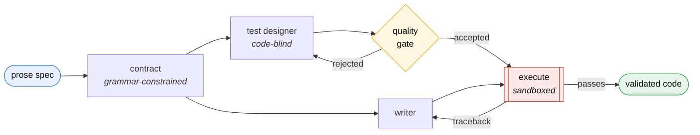
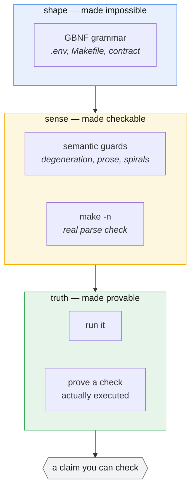
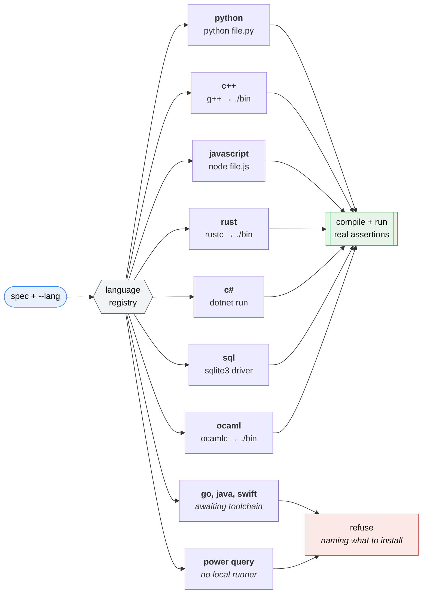

# PureCoder

[](https://github.com/jurewiczM/PureCoder/actions/workflows/tests.yml)
[](pyproject.toml)
[](LICENSE)

A constrained, code-only coding agent that runs on a **6 GB laptop GPU**.

PureCoder wraps an open-weights code model (Qwen3-Coder-30B-A3B, or a 7B) in a
harness that makes its output *reliable* rather than merely plausible: grammars
force valid config files, real tools validate every artifact, generated code is
checked by **actually running it** against independently-written tests, and a
fix loop feeds real errors back until the output works. It scaffolds whole
small projects and grounds generation in a library's own docs via retrieval.

Three roles do the work — a **contract** deriver, a **code-blind tester**, and
a **writer** — each with its own prompt and its own line in a ledger that
records how many attempts it spent against the cap the run actually had. The gate that judges them is
deliberately *not* one of them: it never asks a model anything. Agents propose;
tools dispose.

The bet: a small model, boxed in from several directions, can produce
trustworthy code — no frontier API, no cloud, nothing leaving your machine.

## See it work

One command. It starts a model server if one is not already up, generates the
same task in every language your machine can actually build and run, and prints
what happened:

```bash
scripts/demo.sh
```

```
LANGUAGE     VERDICT  ATTEMPTS  STOPPED-ON EVIDENCE
c#           ok       1         -          compiled, ran, checks executed
c++          ok       1         -          compiled, ran, checks executed
javascript   ok       1         -          compiled, ran, checks executed
ocaml        ok       1         -          compiled, ran, checks executed
python       ok       1         -          compiled, ran, checks executed
rust         ok       2         -          compiled, ran, checks executed
sql          refused  4         writer     tester 2/writer 4 — CHECK FAILED
```

Every `ok` there means the code was compiled where the language needs it, run
in a sandbox, and proved that a check actually executed. The refusal is the
pipeline working: there is no tier in which unvalidated code is emitted.

That SQL row is worth a second look, because it is the honest case. The writer
produced `SELECT COALESCE(SUM(n), 0) AS total FROM totals`, which is correct.
The tester was what could not be satisfied — the loop suspected as much at
attempt 4 and redesigned the suite, which is why the ledger reads `tester 2`.
`stopped on: writer` says where the run ran out, not what was wrong, and the
table shows both because showing only the first is how you end up fixing
correct code.

## How it works

Every arrow out of the model leads into something that can say **no**:



The test designer never sees the implementation, so it cannot rubber-stamp a
bug. The gate judges the tests before they judge the code. The executor is the
only thing allowed to declare success, and only by running.

Those three boxes are the three roles, and each one's spend is recorded as the
run happens — so a failed run can say which role it ran out on instead of
leaving you to infer it from a log. That matters because `ok=False attempts=4`
reads identically whether the model wrote bad code or the harness refused good
code, and those are opposite bugs.

## Why it's interesting

Most "LLM writes code" demos trust the model. PureCoder verifies it. Every
layer assumes the model can be wrong and catches it:

- **Grammars** (llama.cpp GBNF) make invalid `.env` / Makefile output
  structurally impossible — not discouraged, impossible.
- **Real-tool validators** run `make -n` and semantic guards on config;
  a validator that rubber-stamps garbage is worse than none.
- **Execution validation** runs the code against **code-blind** tests
  (the tester never sees the implementation, so it can't rubber-stamp bugs).
- **A test-quality gate** rejects bad tests before they judge code —
  "who tests the tester."
- **Spec contracts** turn prose into a structured contract the writer and the
  tester both read, and print it — so a misread spec is visible before any code
  runs, instead of silently agreed on by both.
- **Retrieval** injects a library's real docs only when relevant, keeping
  token use low on a tight context budget.

### What each layer catches



A grammar guarantees *shape* and nothing more — a 2500-character comment is a
structurally valid comment. Validators add *sense*. Only execution gives
*truth*, and even then exit code 0 is not evidence: the tests are instrumented
so a suite that never ran an assertion fails instead of passing.

## Install

```bash
git clone https://github.com/jurewiczM/PureCoder.git
cd PureCoder
pip install -e .            # core pipeline
pip install -e ".[rag]"     # + retrieval (pulls in torch, ~2 GB)
```

llama.cpp is a **runtime dependency, not vendored here**. Build it separately
with CUDA and serve the model:

```bash
git clone https://github.com/ggml-org/llama.cpp
cd llama.cpp && cmake -B build -DGGML_CUDA=ON && cmake --build build -j

./build/bin/llama-server \
  -hf unsloth/Qwen3-Coder-30B-A3B-Instruct-GGUF:Q3_K_M \
  -ngl 99 --cpu-moe -c 16384 -fa on -ctk q8_0 -ctv q8_0 --port 8080
```

A 30B on a 6 GB card is not a typo. It is a mixture of experts: `--cpu-moe`
keeps the expert tensors in system RAM and only ~3B parameters activate per
token, so the card holds attention and the KV cache alone.

Measured on that card, same five OCaml tasks, same index:

| weights | offload | VRAM | speed | tasks passed | attempts |
|---|---|---|---|---|---|
| **30B-A3B Q3_K_M** | **`--cpu-moe`** | **1.9 GB** | **33 tok/s** | **5 / 5** | **5** |
| 30B-A3B Q3_K_M | `-ncmoe 36` | 5.1 GB | 41 tok/s | — | — |
| 7B Q5_K_M | 24/29 | 4.7 GB | 23 tok/s | 5 / 5 | 10 |
| 7B Q4_K_M | 29/29 | 4.9 GB | 40 tok/s | 3 / 5 | — |

Three results decided these flags. **The 7B at Q5 also passes everything** —
the model was never this pipeline's bottleneck, and eight harness defects were
([2026-08-07](docs/live-runs/2026-08-07-the-harness-was-the-bottleneck.md)).
The 30B earns the default on half the attempts, 40% of the VRAM and 1.4× the
speed, not on the score. **Full offload is the fastest and the wrong choice**
in either architecture: the embedder needs ~275 MB on the same card, so a
configuration that leaves it nothing kills every doc-grounded run. And **the
smaller quantisation is still worse**: Q4_K_M passes three of five where the
other two pass all of them — it was two of five before the harness was fixed,
with a retry budget raised from four to seven recovering none of them.
Throughput does not buy capability back.

To run the 7B instead — 5 GB of weights rather than 15, and no MoE support
needed in your llama.cpp build:

```bash
./build/bin/llama-server \
  -hf Qwen/Qwen2.5-Coder-7B-Instruct-GGUF:Q5_K_M \
  -ngl 24 -c 16384 -fa on -ctk q8_0 -ctv q8_0 --port 8080
```

Four times the context costs about 500 MB, which is the trade this pipeline
wants: the pressure is on the prompt (retrieved docs, the contract, the previous
attempt, the source quoted around a diagnostic), not on the 512-token output
budget, which measurement shows is not binding.

## Quickstart

```bash
purecoder status
purecoder code "a function parse_ports(s) returning a sorted list of unique valid ports (1-65535), raising ValueError on bad input"
purecoder make "Makefile for a python project: install, test, lint, clean"
purecoder project portcheck "a CLI that reads PORTS env var and prints valid ports"
```

`python -m purecoder <cmd>` works identically if you'd rather not install the
console script.

## RAG over a library's docs

```bash
purecoder ingest ./some_library/docs --store lib
purecoder ask "write code using <that library> to do X" --store lib
```

`ingest` shows you what it is about to index and waits — every file with its
chunk count, plus what it pruned, skipped as binary, or dropped as a duplicate.
`[e]` drops paths or globs and re-plans; nothing is embedded until you accept,
because chunking is free and embedding is not. It prints the `--exclude` flags
matching your choices so the same index can be rebuilt in one command. `-y`
skips the review, as does a non-interactive stdin.

Embedding is the slow part, so the index persists to `<store>.npy` / `.json` —
ingest once, reuse across runs.

Ranking uses two signals: embedding similarity for *what this is about*, and an
exact-name score for *what you literally typed*. Embeddings are worst at API
symbols, which is most of what gets asked here — `Printf.eprintf` retrieves the
page defining it even when a page merely about output formatting embeds closer.

`ingest` also collects every qualified name the docs use. It cannot tell you a
name is wrong — prose documentation never enumerates a module, and assuming
otherwise flagged 45 pieces of correct code in the measurement that settled it
— but once the compiler has rejected a name, it answers *did you mean* from the
real API instead of leaving the fix loop guessing.

## Commands

| command | what it does |
|---|---|
| `code "<spec>"`    | execution-validated function (`--lang` picks the language) |
| `env "<spec>"`     | grammar-valid `.env` |
| `make "<spec>"`    | validated Makefile |
| `project <name> "<spec>" [dir]` | scaffold a whole project (code + Makefile + .env + README) |
| `ingest <dir>`     | build a RAG index over docs/code, after showing you what it will index |
| `ask "<spec>"`     | doc-grounded, execution-validated code |
| `learn <name> <docs>` | draft a language entry from its docs, probe it, keep its docs |
| `measure`          | run the contract measurement: five ambiguous specs, both arms |
| `status`           | live system status |
| `serve [--port N]` | the same pipeline over local HTTP |

```bash
purecoder code --tdd "a function parse_ports that ..."   # test-first
```

`--tdd` turns the request into a contract, the contract into tests, and then
**proves those tests fail** against an implementation that does nothing --
before writing any. A suite a do-nothing stub satisfies has demonstrated
nothing, and no amount of parsing can tell you that. The tests and their
failure are shown for confirmation, which is the one moment to catch a contract
that misread you; `-y` skips the question. Python only: a stub needs a real
signature in a compiled language, and there an empty implementation is a
compile error rather than evidence.

`code --with numpy` declares a third-party package the generated code may use.
It is probed in the sandbox interpreter *before* anything is generated, so a
package that is not installed is refused with the `pip install` line rather than
discovered three attempts later; the permission reaches the test designer too,
and the stdlib-only retry no longer withdraws it. Python only — every other
language refuses the flag instead of ignoring it.

Flags worth knowing: `--lang` picks the language; `--store` names a RAG index
(otherwise a learned language uses its own); `--no-docs` ignores it; `-y` skips
the ingest review; `--exclude GLOB` leaves paths out of an index.

`code`, `ask` and `project` all ground themselves the same way — one resolver,
so they cannot drift apart. In a scaffold the documentation reaches the
execution-validated module only; the Makefile, `.env` and README are generated
without it on purpose.

`project` derives a spec contract by default; `code` does not. Add
`--contract` to opt in, `--no-contract` to opt out, or set
`PURECODER_CONTRACT=1` to change the default for both.

## Calling it from something that isn't a terminal

```bash
purecoder serve                 # 127.0.0.1:8100
```

```bash
curl -s -X POST localhost:8100/code -H 'Content-Type: application/json' \
  -d '{"spec": "a function gcd(a, b) ...", "lang": "python"}'
```
```json
{"ok": true, "code": "def gcd(a, b): ...", "tests": "assert gcd(0, 0) == 0\n...",
 "contract": null, "attempts": 2, "error": ""}
```

`POST /code`, `POST /ask`, `GET /status`. Nothing is relaxed by the change of
surface: the same gates run, the same refusals come back, and there is still no
tier in which code is emitted unvalidated.

**The status code tells you whose problem it is.** A refusal is `200` with
`ok: false` and the reason — the pipeline declining is the pipeline working, and
a 500 would say PureCoder broke. `400` means the request was malformed and
nothing was ever generated. `503` means llama-server is down, which is neither
of those. Every answer carries the same six keys whatever happened, so a client
never has to branch on which fields exist.

**It binds loopback, and that is not a preference.** `/code` runs
model-authored code in a subprocess on this machine, so `--host` exists for a
container's own interface rather than as a suggestion. There is no auth because
there is no remote.

`/code` blocks for the length of a generation, which is minutes. A job queue
would add state, polling and a way to lose a result; if an editor needs it
non-blocking, that is a wrapper around this rather than a rewrite of it.

## Watching it work

The pipeline over HTTP has a page in front of it. Three sections, each backed
by an endpoint: **Runs** (a generation's transcript, streamed as it happens,
with the role that produced each line), **Languages** (the registry as probed
on this machine, with the reason for every refusal) and **Grammars** (each
`.gbnf` and its root rule).

```bash
purecoder serve --port 8100          # one terminal
cd UI/app && pnpm install && pnpm dev  # another; http://127.0.0.1:5273
```

The transcript is the page rather than a detail view, and that is the one
layout decision worth defending: a verdict cannot tell a bad implementation
from a refused-but-correct one, and the transcript can. See
[UI/README.md](UI/README.md).

## Layout

```
purecoder/
  agents.py      the three roles, and the ledger of what each one spent
  client.py      grammar-constrained generation (llama-server /completion)
  contract.py    prose → grammar-constrained spec contract
  languages.py   what we can generate, and what we can prove
  validate.py    config validators + write→validate→fix loop
  execute.py     code-blind test designer, test-quality gate, execution validation
  scaffold.py    multi-artifact project orchestrator
  rag.py         code/doc-aware chunking (AST + tree-sitter) + retrieval
  symbols.py     the names the docs use, and what they can honestly decide
  status.py      live system probe
  server.py      the pipeline over local HTTP, for callers that are not a terminal
  bootstrap.py   draft a language entry from its docs, then probe it
  langstore.py   where a learned language and its docs live between runs
  bench.py       ambiguous specs + hidden oracles: does grounding help?
  cli.py         one entry point over all of it
  grammars/      GBNF: env.gbnf, makefile.gbnf, contract.gbnf
UI/app/          a local page over the HTTP surface (see UI/README.md)
examples/        runnable scripts + portcheck/, a real scaffolder output
scripts/         demo.sh, smoke.sh, and the benchmark corpus
tests/           655 tests (no GPU, no server; toolchain ones self-skip)
docs/            ARCHITECTURE.md, STATUS.md
```

## Running it where nothing is missing

```bash
docker build -f docker/Dockerfile -t purecoder-toolchains .
git archive HEAD --prefix=repo/ | docker run --rm -i \
  -e PURECODER_REQUIRE_ALL_LANGUAGES=1 purecoder-toolchains sh -c '
    cd /tmp && tar x && cd repo
    python3 -m venv /tmp/v && /tmp/v/bin/pip install -q -e ".[dev,chunking]"
    /tmp/v/bin/pytest -q -rs'
```

One image, every toolchain the registry can run — `g++`, `make`, `node`,
`ocamlc`, `python3`, `rustc`, `dotnet`. .NET is the base image rather than a
package because C# here is a file-based app (`dotnet run candidate.cs`, no
`.csproj`), which needs SDK 10.

The point is that a skip stops being silence. `purecoder`'s registry puts every
language in exactly one state — runnable, declared-but-unimplemented,
permanently unvalidatable, or **missing a named binary** — and CI runs the
suite inside this image with `PURECODER_REQUIRE_ALL_LANGUAGES=1`, where a
missing toolchain is a failure rather than a quiet skip. Measured: 565 passed
and 0 skipped in the image, against 549 passed and 10 skipped on a bare runner.

Outside that job a skip is reported and not fatal, so a machine without Docker
keeps working. The image executes generated code; generation needs the GPU and
stays on the host.

## Development

```bash
pip install -e ".[dev]"
pytest -q
ruff check purecoder tests examples
```

The suite runs without llama-server or a GPU: the validators, executor, test
gate and chunkers are model-independent by design, and the loops are driven by
a scripted fake model. That is also what CI runs, on Python 3.10–3.12.

## Languages

`--lang` picks the language; a registry entry declares how to build it, run it,
and how its tests assert. Adding a language is *data*, not code — the executor,
CLI and scaffolder need no changes.



SQL is the odd one, and worth a sentence. It has no assertion and no way to end
a script non-zero — SQLite's `RAISE` takes a literal, so a failing check cannot
name itself, and `SELECT 1/0` returns NULL. So a check is a **row**: the harness
creates `pc_checks(ok, label)`, the tests insert booleans into it, and the
stdlib `sqlite3` driver reads the verdict back — no rows means "no checks ran",
and every failing row prints its own label. It has no project layout, so
`project --lang sql` refuses and `code` is unaffected.

```bash
purecoder --lang c++ code "a function add(int, int) returning their sum"
purecoder --lang c++ project calc "a small calculator library" ./calc
purecoder --lang sql code "a view over orders showing revenue per customer"
```

### Teaching it a language

```bash
purecoder learn zig ./zig-docs --ext .zig
```

Points the pipeline at a language's documentation and has it draft its own
registry entry: the check helper, the harness tail, the tester prompt, and the
build/run commands. The drafting prompts carry the C++, JavaScript and Rust
entries as *worked examples*, because
[measured results](https://huggingface.co/papers/2501.19085) show translation
examples help at every model size while prose translation rules score *below*
baseline on a third of runs. For the same reason the tester prompt is templated
rather than drafted — a model writing its own instructions is the technique
that measured worst.

Nothing is registered until it proves itself. Five probes run against a trivial
`add(a, b)` on the real toolchain — a correct implementation passes, a wrong
one fails, an empty suite fails, a broken one produces a diagnostic, a failing
check fails the run — and then one live round on a bubble sort. A harness that
merely compiles is not a harness that can fail wrong code, and only the second
kind is worth having.

The drafted build/run commands are shown and need explicit confirmation before
they first execute: every other entry's commands were written by hand, and
these are the one place a local model's output becomes a process. They are argv,
never a shell string, and shell syntax is refused outright.

A learned language is stored as JSON under `$PURECODER_HOME` (or XDG), marked
with where it came from, and can never shadow a built-in entry. Delete it with
`rm`.

The governing rule: **if it cannot be executed, it is not emitted.** A missing
toolchain is refused with the binary named. Power Query M runs only inside
Excel and Power BI, so no local execution is possible at any effort level — it
is refused permanently, and this says so rather than pretending otherwise.

Each language's harness injects its own check helper (`PC_CHECK`, `pc_check!`)
and the tester is told to use it. That is what lets the run *prove* a check
executed rather than inferring it from exit code 0 — the false green the Python
path shipped for months — without needing a parser per language.

## Architecture

See [docs/ARCHITECTURE.md](docs/ARCHITECTURE.md) for the full design and the
lessons that shaped it. In one line: **writer → validator → fix loop**, per
artifact, with the model's confidence never trusted over an external tool's
verdict.

## Requirements

- A GPU with ~6 GB VRAM (built and tested on an RTX 4050 Laptop)
- llama.cpp built with CUDA, serving Qwen3-Coder-30B-A3B at Q3_K_M with
  `--cpu-moe`, or Qwen2.5-Coder-7B at Q5_K_M (Q4_K_M is smaller and faster and
  measurably worse — see the table above)
- Python 3.10+, `requests`, `numpy`; `sentence-transformers` for RAG

## Numbers

Sixty runs of the ten-task corpus, six languages, Qwen3-Coder-30B-A3B Q3_K_M on
a 6 GB card, 2026-08-16 (`scripts/bench/attribution.py`):

| language | ran | passed | median attempts | refused | stopped on |
|---|---|---|---|---|---|
| c# | 10 | 10 | 1 | 0 | — |
| c++ | 10 | 10 | 1 | 0 | — |
| javascript | 10 | 10 | 1 | 0 | — |
| ocaml | 10 | 9 | 1 | 1 | writer |
| python | 10 | 9 | 1 | 1 | writer |
| rust | 10 | 10 | 1 | 0 | — |

**58 of 60 passed, 50 of them on the first attempt, in 16 minutes.**

Now the caveats, which matter more than the table.

**This corpus saturates.** Five of six languages score 10/10, and did before
this measurement too. A high pass rate here is evidence that the tasks are
easy, not that the model is good — the number that still moves is attempts, and
50 first-attempt passes is the 30B's actual case over the 7B it replaced.

**SQL is absent, and that is the interesting part.** It scored 0/10 on the
first run, every task "stopped on writer". One transcript explains it: `no such
function: sum_list`. Every task asks for a function and SQLite has no
user-defined functions, so no attempt could ever have passed. That 0/10 is a
fact about the task set, and the runner now skips SQL with that reason rather
than reporting a score — because a number nobody reads the transcript behind is
how this project has misled itself before.

The rest of the caveats, including the two runners that disagree about
measuring OCaml ungrounded, are in [docs/STATUS.md](docs/STATUS.md).

## What is proven, and what is not

Worth being plain about, because the distinction is the point of the project.

**Proven.** Seven languages compile, run and prove a check executed. 655 tests
pass without a GPU or a server, and a CI job runs them in a container carrying
every toolchain with nothing allowed to skip. A refusal is returned as a
refusal, all the way out to the shell's exit code.

**Measured, and weaker than hoped.** The contract layer's instrument was built
and run twice and could not see what it exists to see — nine of ten arms ended
in the loop refusing, and spec-divergence only exists downstream of a passing
run. Retrieval helps only where the model is ignorant and can actively hurt: a
doc-grounded `sum_list` once failed four attempts where the ungrounded one
passed first try.

**Not proven.** That the retrieved documentation on a retry is *useful* — the
mechanism works, the value is unmeasured. That a learned language is
idiomatic; the probes check that it runs, not that a practitioner would
recognise it. And the benchmark corpus saturates, so its pass rate is a fact
about the tasks rather than the model.

Every live session so far has found defects a fully green suite could not:
eight, then six, then nine, then six. The full ledger is in
[docs/STATUS.md](docs/STATUS.md), including the ones still open.

## License

MIT — see [LICENSE](LICENSE).
