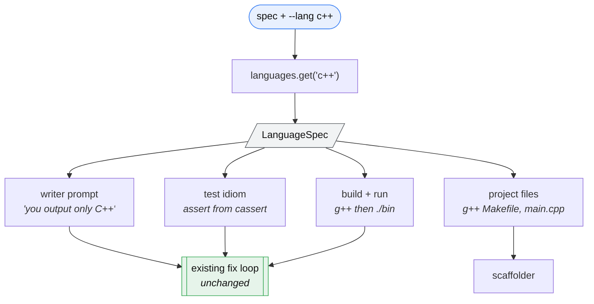

# Multi-Language Validation — Design

_2026-08-02_

## Problem

PureCoder claims to be a "code-only agentic coder". It is a *Python*-only one,
and nothing in the pipeline said so.

The writer prompt hardcodes `language="python"`, the executor runs the
candidate with `sys.executable`, and the scaffolder writes a Makefile full of
`pip install` and `pytest`. Ask for a C++ implementation of Dijkstra and you
get `import heapq`. Ask for a Power Query M expression and you get
`import requests`. Both were observed live, and both are worse than a wrong
answer: they are answers of the wrong *kind*, produced silently.

A stopgap now refuses a spec that names a foreign language. That keeps the
tool honest but leaves it narrow. The local model writes competent C++; the
limitation is entirely in the harness.

## Decisions

Four decisions frame everything below. Each was made explicitly.

1. **Breadth of languages, validated properly** — not breadth of output with
   relaxed checking. C++, JavaScript, Rust and C# first, since `g++`, `node`,
   `cargo` and `dotnet` are all present. SQL joins them: Python's stdlib ships
   `sqlite3`, so it needs no external binary. Go, OCaml, Java and Swift become
   registry entries that activate when their toolchain appears.
2. **Refuse anything that cannot be executed.** No trust tiers, no "generated
   but unchecked" output. Everything PureCoder emits has compiled and run.
3. **Contracts stay, in every language.** The contract is language-neutral
   JSON; it grounds the writer and the tester and is displayed for review.
4. **Anchors are removed entirely**, in Python too. See the trade-off below.

### The anchor trade-off, stated plainly

Mechanical anchors were the only assertions in the suite that no model wrote,
and they cost five separate Critical false-greens to make safe. Removing them
means every assertion is model-authored again — the exact condition under
which `examples/portcheck/` shipped code and tests that agreed on a misreading.

Two things make this defensible rather than a regression. The contract attacks
the same root cause from the other side: the shared interpretation becomes a
visible artifact before any code exists. And empirically the anchors were
contributing less than their complexity implied — across eight live runs, most
examples were dropped as non-literal, leaving zero to two surviving anchors per
run.

The honest summary: this trades a small amount of *mechanical* verification for
uniformity across languages and the removal of the pipeline's highest-risk
component.

## Architecture

One new module, `purecoder/languages.py`, holds a registry of language specs.
Adding a language is adding one entry — no edits to the executor, the CLI, or
the scaffolder.

### `LanguageSpec`

| field | purpose | C++ | JavaScript |
|---|---|---|---|
| `name` | CLI value | `c++` | `javascript` |
| `extension` | candidate filename | `.cpp` | `.js` |
| `probe` | availability check | `g++ --version` | `node --version` |
| `build` | optional compile step | `g++ -std=c++17 {src} -o {bin}` | *(none)* |
| `run` | execute the candidate | `{bin}` | `node {src}` |
| `assemble` | join code + tests into one source | tests inside `int main()` | append after `require('assert')` |
| `test_system` | assertion idiom for the tester prompt | `assert()` from `<cassert>` | `assert.deepStrictEqual` |
| `project` | entry filename, make targets, install command | `main.cpp`, `g++`-based | `main.js`, `npm`-based |
| `unvalidatable` | reason, if it can never run locally | — | — |

Availability is **probed, not assumed**. `go`, `javac` and `swiftc` get entries
now and simply report unavailable until the binary exists, at which point they
work with no code change. Power Query M carries a permanent `unvalidatable`
reason: the language runs only inside Excel and Power BI, so no local execution
is possible at any effort level.

SQL is validatable without any external binary — Python's stdlib ships
`sqlite3` — so it is a registry entry like the others rather than a refusal.

## Data flow

`run_python(code, tests, …)` generalises to
`run_candidate(spec, code, tests, timeout, require_checks)`:

1. `spec.assemble(code, tests)` produces one source file.
2. Write it to a temp dir as `candidate{spec.extension}`.
3. If `spec.build`, run it; a non-zero exit is a compile failure and its
   stderr is the feedback fed back to the model.
4. Run `spec.run` in its own process group, with the existing timeout.
5. Reap the process group, then interpret the exit code as today.

Everything already proven is preserved: process-group cleanup, timeout
handling, traceback trimming to the last twelve lines, missing-dependency
detection, the no-progress detector, and `lint_implementation`.

`require_checks` needs care. The current instrumentation rewrites the Python
AST, which cannot work for other languages. Each spec's `assemble` is
responsible for emitting an equivalent counter — for C++ an `int` incremented
by a macro wrapping `assert`, for JavaScript a counter around a wrapped
`assert`. A language whose `assemble` cannot provide one declares
`counts_checks = False`, and the executor falls back to exit-code-only
validation for it, with that weakening logged rather than hidden.

## Error handling

| situation | behaviour |
|---|---|
| `--lang` names an unknown language | list the registry, exit non-zero |
| toolchain absent (`go`, `javac`) | refuse, naming the missing binary and how to install it |
| language permanently unvalidatable (Power Query) | refuse, stating why no local runner exists |
| compile fails | feed the compiler's stderr back; a compile error is a normal fix-loop failure, not an abort |
| build tool missing mid-run | treat as toolchain absent |
| `--lang python` but the spec demands C++ | keep a reduced form of today's spec-sniffing check |

The governing rule from the existing layer holds: degrade honestly, never
silently.

## What changes

**Deleted** — `purecoder/anchors.py`, `tests/test_anchors.py`, `count_anchors`,
`_designer_floor`, and the anchor plumbing in `execute.py`. About 350 lines.
`MIN_ASSERTIONS` returns to a flat floor.

**Unchanged** — `purecoder/contract.py` in full, `validate.py`, `rag.py`,
`client.py` apart from the writer prompt taking a language.

**Generalised** — `execute.py` (runner and prompts), `scaffold.py` (per-language
Makefile, README and entry filename), `cli.py` (a `--lang` flag defaulting to
`python`).

**Replaced** — `unsupported_language()`. With an explicit `--lang`, refusal
becomes exact rather than guessed; the heuristic survives only to catch a
mismatch between the flag and the spec.

## Testing

Model-independent, as the existing 186 are. No GPU, no server.

- **Registry** — every spec has the required fields; every `probe` is a real
  command; unknown names raise; the CLI's `--lang` choices match the registry.
- **Availability** — an absent toolchain refuses with the binary named; a
  present one does not. Probing is mocked so the suite does not depend on which
  compilers the machine has.
- **Per-language execution**, skipped when the toolchain is absent so CI stays
  green anywhere: a correct implementation passes, a wrong one fails, a compile
  error surfaces the compiler's message, an infinite loop times out, and a
  spawned child does not outlive the run.
- **Check counting** — a language declaring `counts_checks` must fail a suite
  whose assertions never execute, mirroring the Python test that caught the
  original false green.
- **Scaffolder** — a C++ project gets a `g++` Makefile, not `pip install`.
- **Regression** — the full existing Python suite must pass unchanged. Python
  is one registry entry among several and must behave exactly as before, minus
  anchors.

## Out of scope

- **Long-running artifacts.** A web server cannot be validated by running a
  module to completion, in any language. This is the "empty servers" failure
  and it is a separate design.
- **Multi-file projects.** One candidate file per run, as today.
- **Cross-language projects.** A Python backend with a TypeScript frontend is
  not addressed.
- **Toolchain installation.** The registry probes; it never installs.
